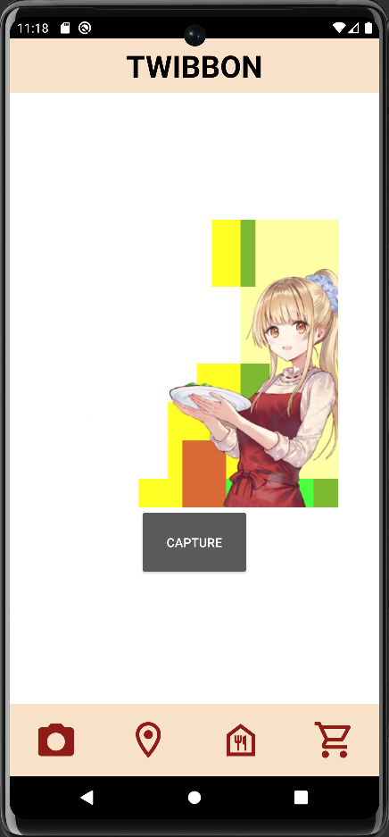
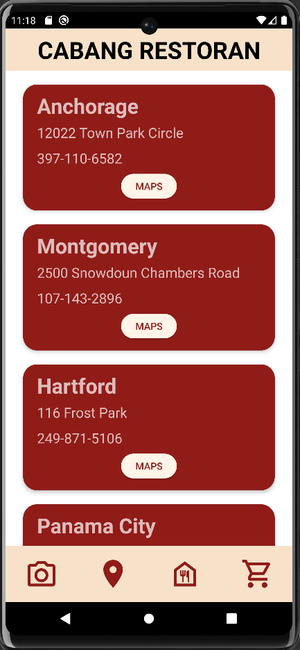
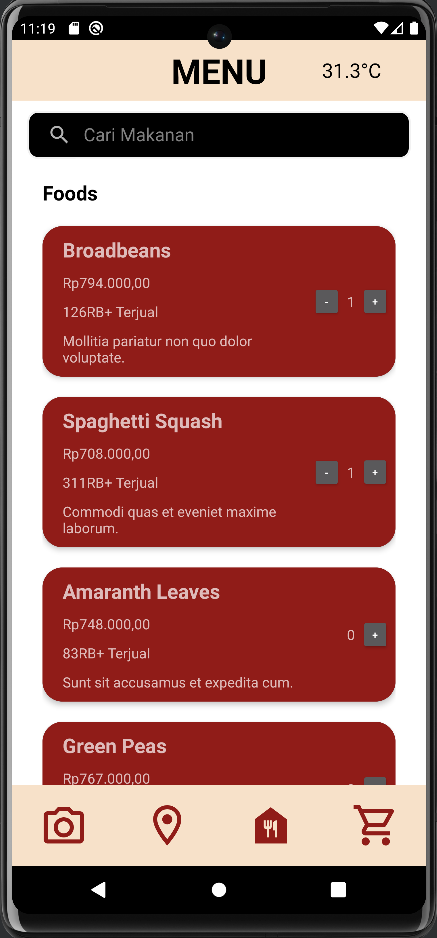
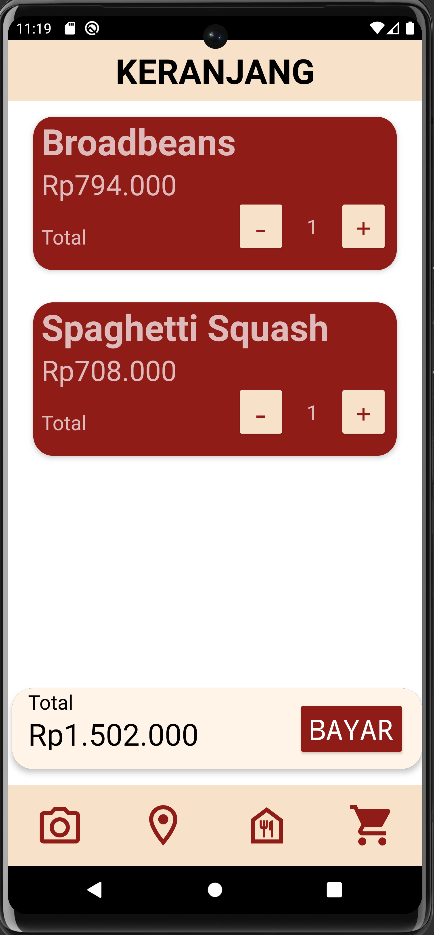
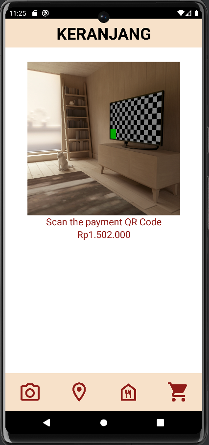

## Majika
Sebuah aplikasi Android yang dibuat oleh BAStian dan friends untuk membantu Doni. Aplikasi Android ini mengikuti spesifikasi yang telah didefinisikan, seperti sebuah halaman Twibbon, halaman Cabang Restaurant, halaman Menu, dan tidak lupa halaman Keranjang

> *Key point to note, harusnya Doni minta bantuan orang lain agar tidak menyusahkan orang yang tidak dikenal* 😶

## Library
- ViewModel
- LiveData
- RecyclerView
- Retrofit
- Coroutines
- Room
- CameraX
- ML Kit

## Screenshot
- Halaman Twibbon 

- Halaman Cabang Restoran 

- Halaman Menu 

- Halaman Keranjang 

- Halaman Pembayaran 

## Pembagian Kerja

| Fitur                   | PIC                                   |
|-------------------------|---------------------------------------|
| Header dan Navbar       | 13520054 Farrel Farandieka Fibriyanto |
| Halaman Menu            | 13520161 M Syahrul Surya Putra        |
| Halaman Keranjang       | 13520059 Suryanto                     |
| Halaman Pembayaran      | 13520059 Suryanto                     |
| Halaman Cabang Restoran | 13520161 M Syahrul Surya Putra        |
| Halaman Twibbon & QR    | 13520054 Farrel Farandieka Fibriyanto |
| Deploy Backend          | 13520054 Farrel Farandieka Fibriyanto |

## Jumlah Jam

| PIC                                   | Persiapan | Pengerjaaan |
|---------------------------------------|-----------|-------------|
| 13520054 Farrel Farandieka Fibriyanto | 6         | 24          |
| 13520059 Suryanto                     | 6         | 20          |
| 13520161 M Syahrul Surya Putra        | 4         | 20           |
